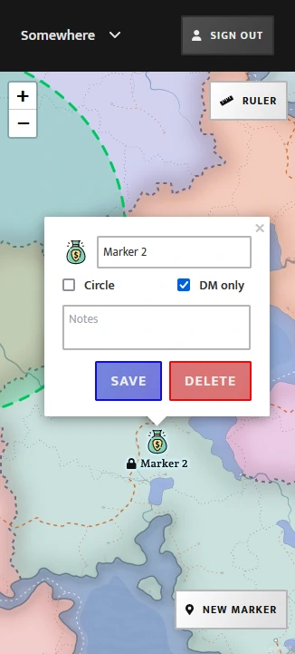

# D&D Map

Map browser for D&D using react-leaflet, with firebase realtime database integration. Shows location of mouse cursors on the map for anyone currently logged in.

## Config

Add the following files and ensure they follow the correct schema (webpack/TS will tell you if it's wrong):

- `auth.config.json`
- `auth.config.dev.json`
- `map.config.json`
- `map.config.dev.json`

## Local dev

- `npm run emulate` to start firebase emulators
- `npm start` to run webpack dev server

## Deployment

`npm run deploy`
